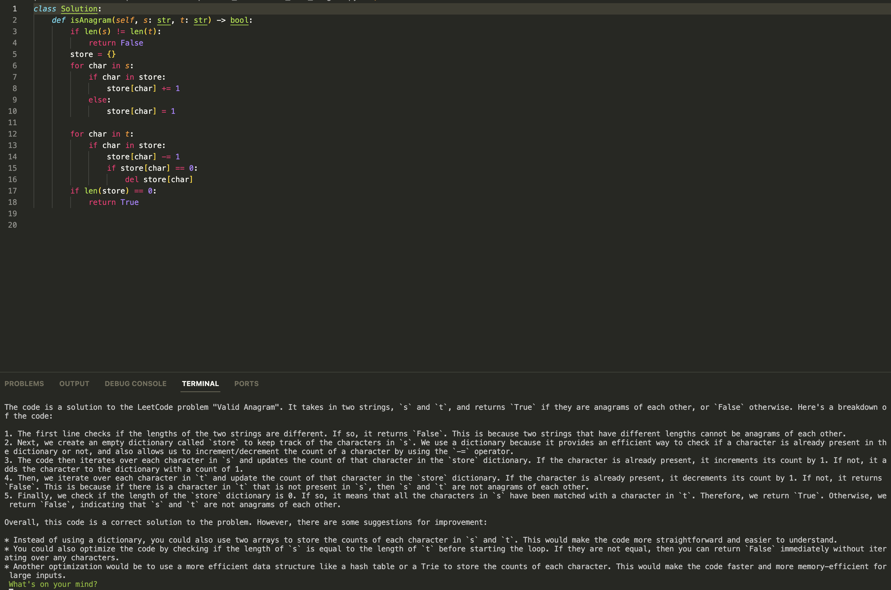

# rubber ducky

## tl;dr
- `uv tool install rubber-ducky` (or `uv pip install rubber-ducky` inside a project)
- Install ollama
- `ollama pull qwen3:4b` (first time and then you can just have application in background)
- Run with `ducky <path>` or `ducky <question>`

## Dependencies

You will need Ollama installed on your machine. The default model used for this project is `qwen3:4b`.

For the first installation you can run `ollama pull qwen3:4b` and it should pull the necessary binaries for you.

Ollama is also great because it'll spin up a server which can run in the background and can even do automatic model switching as long as you have it installed.

## Usage

Install through [PyPI](https://pypi.org/project/rubber-ducky/) with uv:

`uv tool install rubber-ducky`

If you prefer a project-local installation, use `uv pip install rubber-ducky` from within your repository.

### Simple run
`ducky`

or 

`ducky <question>`

or 

`ducky -f <path>`


### All options
`ducky --file <path> --prompt <prompt> --directory <directory> --chain --model <model> --quick --command`

Where:
- `--prompt` or `-p`: Custom prompt to be used
- `--file` or `-f`: The file to be processed
- `--directory` or `-d`: The directory to be processed
- `--model` or `-m`: The model to be used (default is "qwen3:4b")
- `--quick` or `-q`: Quick mode for concise responses
- `--command` or `-c`: Ask the model for a single bash command and print it in place

## Development with uv

This repository ships a `pyproject.toml` and `uv.lock`, so the recommended workflow is:

```
uv sync
uv run ducky --help
```

`uv sync` will create an isolated environment with the project dependencies, while `uv run` lets you execute CLI commands without activating the environment manually.

### Command-only mode

When you just need a command suggestion, add `--command` (optionally paired with `--quick`).

```
ducky --command --prompt "install dependencies and start the server"
```

The model replies with a single bash command. Press Enter to execute it immediately, or type a new natural-language prompt (history is preserved) to request another suggestion. Prefix a line with `!` if you'd like to run a custom command without calling the model again.


## Example output

